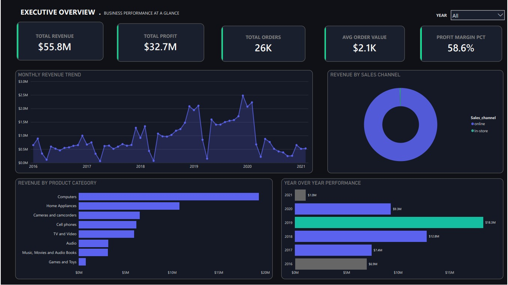
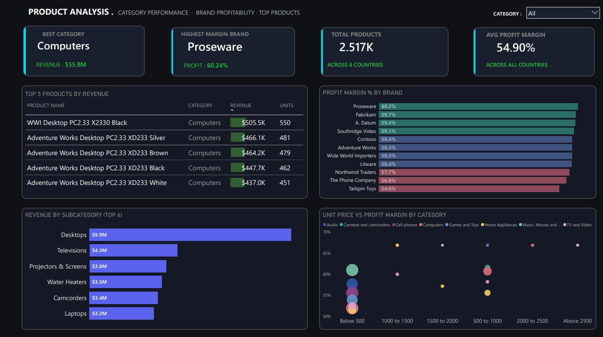
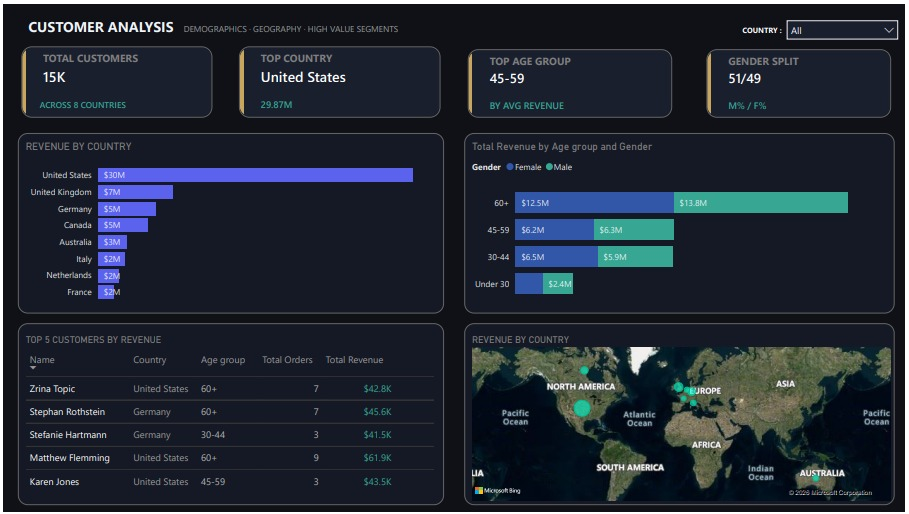

# Global Electronics Retailer Analytics
### MySQL | Power Query | Power BI

## Business Questions Answered
1. Which product categories and brands drive the most revenue and profit?
2. How has revenue trended month over month across years?
3. Which countries and customer age groups are most valuable?
4. What is the average delivery time and how does it vary by region?
5. Which stores are high performers vs low performers?

## Tools Used
- **MySQL** — schema design, data cleaning, 10 advanced SQL queries
- **Power Query** — data transformation, custom calculated columns
- **Power BI** — 4-page interactive dashboard

## Dataset
- Source: Maven Analytics Data Playground
- Tables: Sales (62,884 records), Customers (15,266), 
  Products (2,517), Stores (67), Exchange Rates (11,215)
- Link: mavenanalytics.io/data-playground

## Project Flow
```
5 CSVs → MySQL (schema + cleaning + analysis)
       → Power BI → Power Query (transformations)
       → 4-Page Dashboard
```

## Dashboard Preview





## Key Insights
1. Computers category generates the highest revenue, but Proseware 
   brand leads in profit margin at 61%
2. 45–59 age group is the highest spending customer segment
3. USA contributes 33% of total global revenue
4. Online orders have 99% higher average order value vs in-store
5. Italy has the slowest average delivery time at 5 days

## Data Limitations
- Dataset contains ~99% online orders — channel comparison 
  excluded from dashboard as distribution was insufficient 
  for meaningful analysis
- In-store purchases stored delivery dates as 0000-00-00 
  (converted to NULL during cleaning via SQL UPDATE + 
  temporary strict mode disable)

## How to Run
1. Download clean CSVs from the dataset/ folder
2. Run sql/01_create_tables.sql in MySQL Workbench
3. Import CSVs in order: customers → products → stores → 
   exchange_rates → sales
4. Run sql/02_clean_data.sql
5. Run sql/03_analysis_queries.sql
6. Open Power BI → Get Data → MySQL → localhost/electronics_analytics
7. Apply Power Query transformations
8. Build dashboard referencing screenshots/

## Created By
**Abrar Moinuddin Mohammed**
Aspiring Data Analyst | SQL | Power BI | MySQL
📧 abrarmoinuddin@gmail.com
